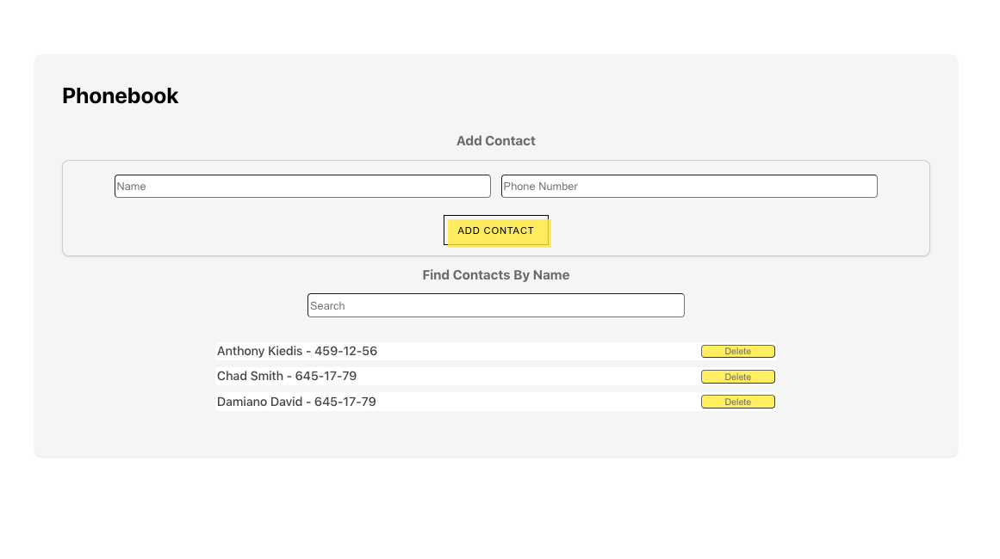

# Phonebook App

Phonebook is a simple React application that allows you to manage a list of
contacts. You can add new contacts, delete existing ones, and filter the list to
find specific contacts. This readme file provides an overview of the Phonebook
application and how to use it.

## Features

- **Add a Contact**: You can add a new contact to the phonebook by providing
  their name and phone number.

- **Delete a Contact**: You can remove a contact from the phonebook.

- **Filter Contacts**: You can filter the list of contacts by name to quickly
  find the ones you're looking for.

## Installation

To run the Phonebook application locally, follow these steps:

1. Clone the repository:# Phonebook App

Phonebook is a simple React application that allows you to manage a list of
contacts. You can add new contacts, delete existing ones, and filter the list to
find specific contacts. This readme file provides an overview of the Phonebook
application and how to use it.

## Features



- **Add a Contact**: You can add a new contact to the phonebook by providing
  their name and phone number.

- **Delete a Contact**: You can remove a contact from the phonebook.

- **Filter Contacts**: You can filter the list of contacts by name to quickly
  find the ones you're looking for.

## Installation

To run the Phonebook application locally, follow these steps:

1. Clone the repository:

   ```bash
   git clone [repository-url]

   ```

2. Change to the project directory:
   ```bash
   cd [repository-name]

   ```
3. Install and start dependencies:
   ```bash
   npm install
   npm start
   ```

The application should now be accessible in your web browser at
http://localhost:3000.

## Usage

**Adding a Contact**

1. Enter the name and phone number of the contact you want to add in the input
   fields.
2. Click the **Add Contact** button to add the contact to the list.

**Deleting a Contact**

1. Find the contact you want to delete in the list.
2. Click the **Delete** button next to the contact's name.
3. Confirm the deletion in the pop-up dialog.

**Filtering Contacts**

1. Enter a name or part of a name in the **Filter** input field.
2. The list of contacts will be updated to display only those that match the
   filter criteria.

## How it works

The main component is **App**, defined in **App.jsx**.

## Dependencies

- React: A JavaScript library for building user interfaces.

  ````bash
  git clone [repository-url]
  cd [repository-name]
  npm install
  npm start ```
  ````

The application should now be accessible in your web browser at
http://localhost:3000.

## Usage

**Adding a Contact**

1. Enter the name and phone number of the contact you want to add in the input
   fields.
2. Click the **Add Contact** button to add the contact to the list.

**Deleting a Contact**

1. Find the contact you want to delete in the list.
2. Click the **Delete** button next to the contact's name.
3. Confirm the deletion in the pop-up dialog.

**Filtering Contacts**

1. Enter a name or part of a name in the **Filter** input field.
2. The list of contacts will be updated to display only those that match the
   filter criteria.

## How it works

The main component is **App**, defined in **App.jsx**.

## Dependencies

- React: A JavaScript library for building user interfaces.
